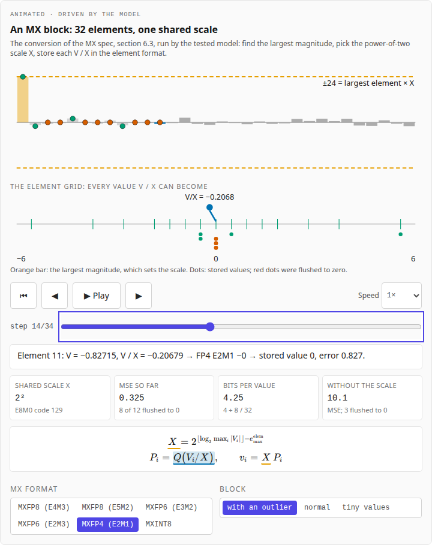
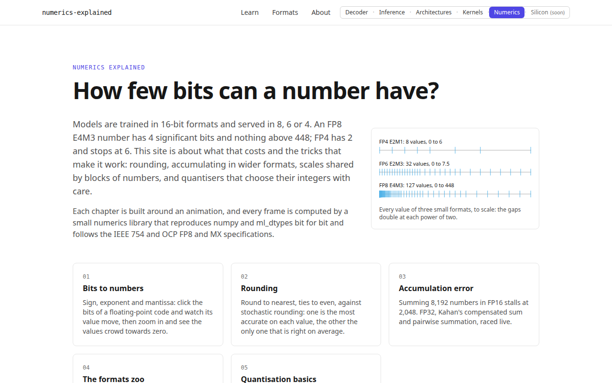
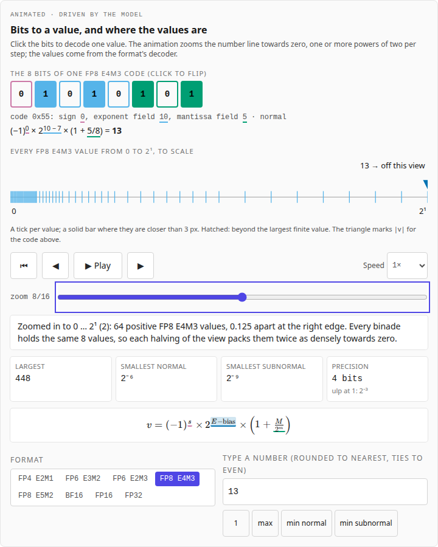
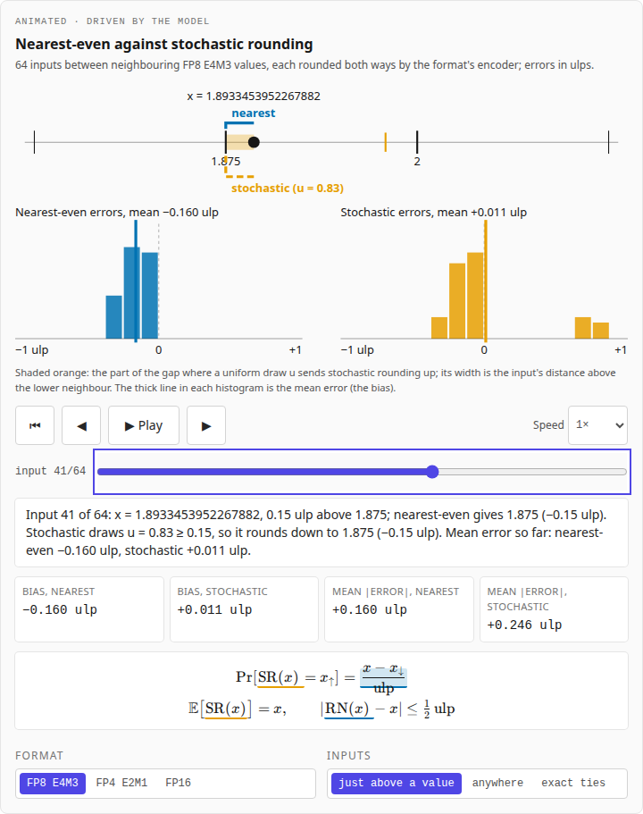
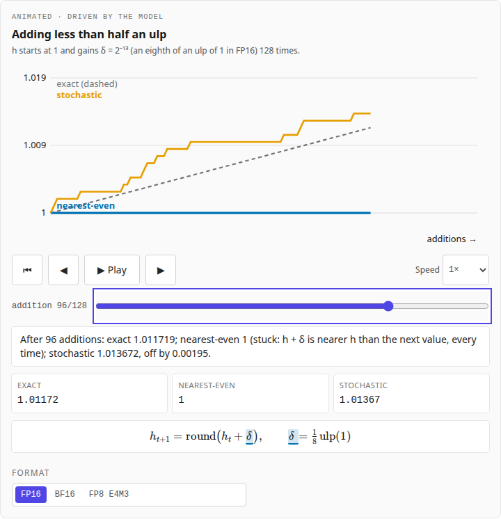
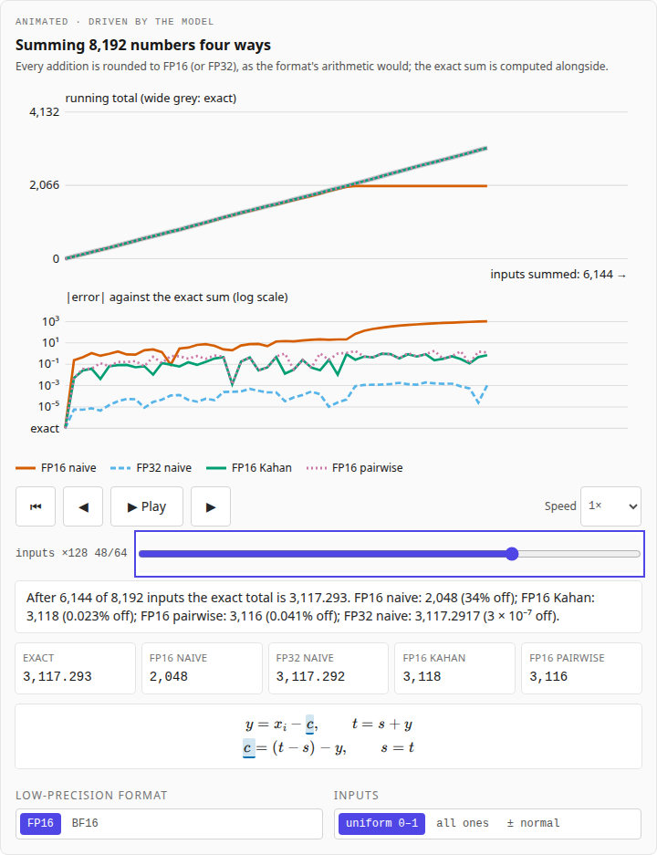
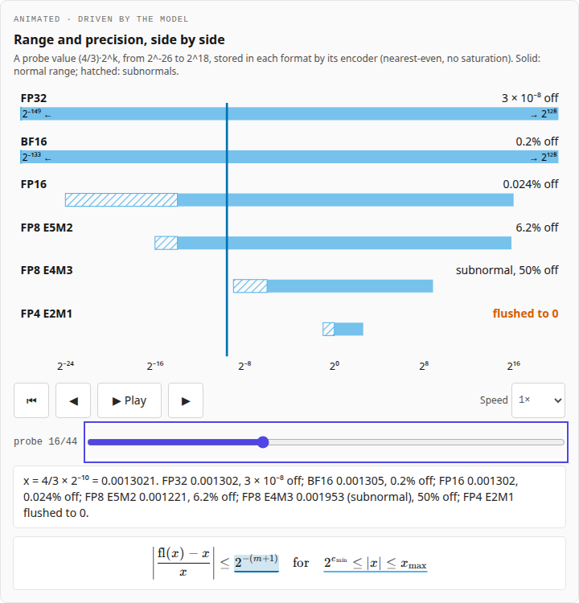
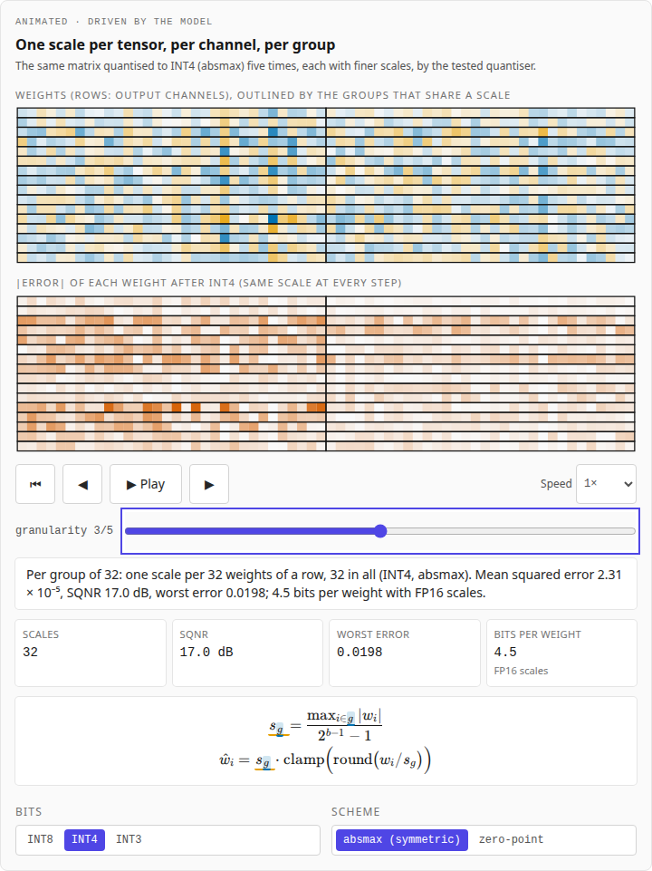
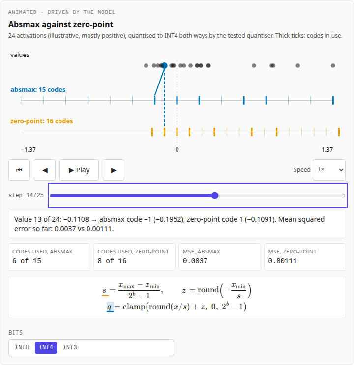
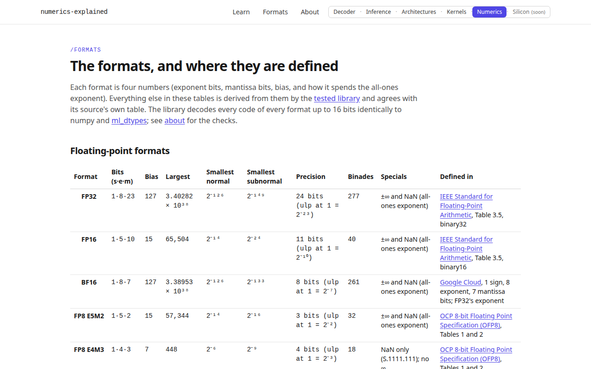

# Numerics Explained

An animated explainer of number formats, rounding and quantisation for
machine learning: how a floating-point code becomes a value, round to
nearest against stochastic rounding, why long sums go wrong in low
precision, the formats zoo (FP8 E4M3 and E5M2, BF16 and FP16, the MX block
formats), and integer quantisation. Every chapter is built around an
animation, and every frame of every animation is computed by a small
**numerics library** that reproduces numpy and ml_dtypes bit for bit and
whose TypeScript port matches its Python reference exactly.

It is the fifth of a family of companion sites: the
[Transformer Decoder Explainer](https://transformer-decoder-explained.vercel.app/)
shows one forward pass, [LLM Inference Explained](https://llm-inference-explained.vercel.app/)
shows how a model is served, [LLM Architectures Explained](https://llm-architectures-explained.vercel.app/)
shows how the models differ, [GPU Kernels Explained](https://gpu-kernels-explained.vercel.app/)
shows how a GPU runs the maths, and this site is about the numbers
themselves. They share one design system and link to each other from the
header ("Decoder · Inference · Architectures · Kernels · Numerics ·
Silicon"; the last is coming).

**Live:** [numerics-explained.vercel.app](https://numerics-explained.vercel.app/)



## Part of

This project sits in the [LLMs](https://github.com/BrendanJamesLynskey/LLMs)
hub, next to the
[Transformer Decoder Explainer](https://github.com/BrendanJamesLynskey/transformer-explainer),
[LLM Inference Explained](https://github.com/BrendanJamesLynskey/llm-inference-explained),
[LLM Architectures Explained](https://github.com/BrendanJamesLynskey/llm-architectures-explained)
and [GPU Kernels Explained](https://github.com/BrendanJamesLynskey/gpu-kernels-explained).
The chapters link the matching slides of the
[Local LLM Hosting](https://brendanjameslynskey.github.io/LLM_Hub_Local_LLM_Hosting/),
[Google TPU](https://brendanjameslynskey.github.io/LLM_Hub_Google_TPUs/),
[NVIDIA GPU](https://brendanjameslynskey.github.io/LLM_Hub_NVIDIA_GPUs/) and
[Linear Algebra for AI](https://brendanjameslynskey.github.io/LLM_Hub_Linear_Algebra/)
series.

## Chapters

| #   | Chapter                                                                                   | The animation                                                                                                                                                 |
| --- | ----------------------------------------------------------------------------------------- | ------------------------------------------------------------------------------------------------------------------------------------------------------------- |
| 01  | [Bits to numbers](https://numerics-explained.vercel.app/learn/01-bits-to-numbers)         | Click the bits of a code (eight formats) and watch the value; the number line zooms towards zero and every representable value crowds in.                     |
| 02  | [Rounding](https://numerics-explained.vercel.app/learn/02-rounding)                       | Inputs rounded to nearest-even and stochastically, error histograms building up; a running sum that nearest-even can never move.                              |
| 03  | [Accumulation error](https://numerics-explained.vercel.app/learn/03-accumulation)         | 8,192 numbers summed naively in FP16 (it stalls at 2,048) and BF16, in FP32, with Kahan's compensation and pairwise; running totals and errors.               |
| 04  | [The formats zoo](https://numerics-explained.vercel.app/learn/04-formats-zoo)             | A probe value swept across six formats' ranges (underflow, subnormals, overflow, saturation); an MX block converted element by element with its shared scale. |
| 05  | [Quantisation basics](https://numerics-explained.vercel.app/learn/05-quantisation-basics) | A weight matrix on a heat map quantised per tensor, per channel and per group, with the error fading; absmax against zero-point on skewed activations.        |

Chapters 6 to 10 (outliers and SmoothQuant, GPTQ, AWQ and NF4, KV-cache
quantisation, quantisation in hardware) are next; the library already
implements GPTQ, AWQ-style scaling, SmoothQuant and NF4.

## Screenshots

|                                                                      |                                                                            |
| -------------------------------------------------------------------- | -------------------------------------------------------------------------- |
|                           |                            |
|  |                           |
|            |                     |
|                            |  |
|      |                 |

Regenerate them with `pnpm build && pnpm start` in one shell and
`pnpm screenshots` in another.

## The numerics library

[`reference/numerics.py`](reference/numerics.py) is plain Python (no numpy),
so that every step is one IEEE double operation;
[`src/lib/num/model.ts`](src/lib/num/model.ts) repeats it operation for
operation. It implements:

- **Formats**: FP32, FP16 ([IEEE 754-2019](https://doi.org/10.1109/IEEESTD.2019.8766229)),
  BF16, FP8 E4M3 and E5M2 ([OCP OFP8 1.0](https://www.opencompute.org/documents/ocp-8-bit-floating-point-specification-ofp8-revision-1-0-2023-12-01-pdf-1)),
  FP6 E3M2 and E2M3 and FP4 E2M1 ([OCP MX 1.0](https://www.opencompute.org/documents/ocp-microscaling-formats-mx-v1-0-spec-final-pdf)):
  decode, and encode from a double in every rounding mode IEEE 754 defines
  (ties to even, ties away, towards +∞, −∞ and zero) plus stochastic
  rounding, with IEEE 7.4 overflow or OCP's saturating mode (E4M3 overflows
  to NaN, FP6 and FP4 always saturate).
- **MX block formats** (MXFP8, MXFP6, MXFP4, MXINT8): a shared E8M0 scale
  per 32 elements by the MX specification's section 6.3.
- **NF4**: [bitsandbytes'](https://github.com/bitsandbytes-foundation/bitsandbytes/blob/833649043474794b8fe7a4136e0c40faf077b2e0/bitsandbytes/functional.py)
  code book, blockwise absmax over 64.
- **Integer quantisation**: symmetric (absmax) and asymmetric (zero-point),
  per tensor, per channel and per group.
- **Summation in a format**: naive, Kahan and pairwise, every addition
  rounded to the format.
- **GPTQ** (one column at a time, exact, on a small layer), **AWQ-style
  scaling** and **SmoothQuant** migration; the exponents α are multiples of
  1/8, computed as products of square roots, so Python and TypeScript agree
  bit for bit (a general `pow` does not).
- The state sequences the animations draw (`*_steps`); a frame is a pure
  function of one state.

### Checked

- [`tests/python/test_numerics.py`](tests/python/test_numerics.py) (100
  tests) compares the reference with **numpy** (every FP16 code; FP16 and
  FP32 conversion from doubles) and **ml_dtypes** (every BF16, FP8, FP6 and
  FP4 code; tens of thousands of conversions, ties and overflows included);
  checks **every rounding and saturation mode** against an oracle that lists
  the format's values and decides in exact rational arithmetic; checks the
  **specifications' tables** (OFP8 Tables 1–3, MX Tables 2–7, worked MX
  conversions), **bitsandbytes' NF4 thresholds** and the NF4 table's
  derivation from normal quantiles; and compares the integer quantisers,
  the three summations (against numpy's own `float16`/`float32` and
  ml_dtypes' `bfloat16` arithmetic) and GPTQ (against its OBS form in numpy)
  with independent implementations.
- [`scripts/make_fixtures.py`](scripts/make_fixtures.py) writes the
  reference's results; [`tests/unit/model.test.ts`](tests/unit/model.test.ts)
  requires the port to reproduce **every value exactly**: every code of
  every format of 16 bits or fewer and every encode case in all six modes
  and both saturation modes (through SHA-256 digests of the IEEE bit
  patterns), and every animation state. CI fails if the fixtures are out of
  date.
- **Frame tests**: [`tests/unit/frames.test.ts`](tests/unit/frames.test.ts)
  and [`tests/e2e/frames.spec.ts`](tests/e2e/frames.spec.ts) set key frames
  of every animation and require the state, and the caption on the page, to
  match the ones built from the Python reference's state.
- Numbers in the chapters are printed from the library at build time
  (`<V of="e4m3.max" />`), every code block shown is cut from the library's
  source ([`content.test.ts`](tests/unit/content.test.ts)), and numbers the
  prose states in words are recomputed in
  [`values.test.ts`](tests/unit/values.test.ts).

**Illustrative, and labelled so on the site:** the data sets (the weight
matrix, the activations, the MX blocks and the vectors summed come from a
seeded integer generator; "normal" values are sums of 12 uniforms), the
bits-per-weight accounting (FP16 scales; a zero point of the weight's
width), and the FP16/BF16 sums rounding after every addition, as a scalar
loop does (GPU kernels accumulate in FP32, in their own order).

**One known difference from ml_dtypes:** ml_dtypes converts a double to
BF16 or FP8 through FP32, so a double close to a tie can round twice; this
library rounds once, as IEEE 754 specifies. The tests compare with ml_dtypes
from FP32 inputs, where both are exact. For a NaN input to FP6 or FP4,
which have no NaN, the MX specification leaves the result to the
implementation: this library gives +0 (ml_dtypes gives −0).

## The animations

Every animation follows the family's visual standard: play and pause, step
back and forward, a scrub bar, speed from 0.25× to 4× and reset; Space and
the arrow keys when it has focus; a live caption per step, also in an
`aria-live` region; no auto-play with `prefers-reduced-motion`; paused when
scrolled out of view; the equation beside the picture, with the term the
animation is on highlighted. Colours are Okabe and Ito's colour-blind-safe
palette, the same in light and dark mode: one colour per bit field (sign
purple, exponent sky blue, mantissa green, shared scale orange) and per
method (nearest-even blue, stochastic orange). The pictures are plain SVG
drawn by React from the library's states (no animation library), and every
SVG label renders at 11 px or more on a 390 px phone.

## Stack

- **Framework**: Next.js 14 (App Router) + TypeScript (strict)
- **Styling**: Tailwind CSS, Tailwind plugin for ESLint + Prettier
- **Content**: MDX via `next-mdx-remote`, KaTeX rendered on the server
- **Library**: Python reference, TypeScript port, JSON fixtures
- **Testing**: pytest (numpy, ml_dtypes), Vitest (exact parity, frames,
  content; 100% line coverage on `src/lib/num/`), Playwright (every page at
  1280 and 390 px, light and dark; every animation's controls; frame tests;
  reduced motion; axe-core scans)
- **CI / deploy**: GitHub Actions (library and fixtures, lint, typecheck,
  unit, e2e, Lighthouse), Vercel

No database and no sign-in: every page is statically rendered, and each
animation is a code-split client component.

### Design system: where each piece came from

Copied from [gpu-kernels-explained](https://github.com/BrendanJamesLynskey/gpu-kernels-explained)
at commit `7242143`, which copied it from the other companion sites:

| Here                                                                                                                                               | From                                                                               |
| -------------------------------------------------------------------------------------------------------------------------------------------------- | ---------------------------------------------------------------------------------- |
| `tailwind.config.ts`, `src/app/globals.css`, `src/app/layout.tsx`                                                                                  | identical apart from titles; `globals.css` has this site's equation-highlight keys |
| `src/components/ui/SiteHeader.tsx`, `SiteSwitch.tsx`                                                                                               | the same header and six-way switch, with Numerics now live                         |
| `src/components/anim/`, `src/lib/anim/clock.ts`, `src/components/viz/useSvgFont.ts`, `src/components/mdx/Eq.tsx`                                   | unchanged                                                                          |
| `src/lib/viz/palette.ts`                                                                                                                           | the family palette, plus this site's bit-field and method colours                  |
| `src/app/learn/`, `src/lib/mdx/`, `Layer.tsx`, `LayerToggle.tsx`, `MdxTable.tsx`, `Controls.tsx`, `Callout.tsx`                                    | copied                                                                             |
| `.eslintrc.json`, `.prettierrc.json`, `tsconfig.json`, `vitest.config.ts`, `playwright.config.ts`, `lighthouserc.json`, `.github/workflows/ci.yml` | adapted (library job, new pages)                                                   |
| `scripts/smoke-check.ts`, `scripts/capture-screenshots.ts`, `RUNBOOK.md`                                                                           | adapted                                                                            |

A shared npm package for the design system would be cleaner in principle;
for a handful of small sites, copying and recording the origin stays
simpler.

## Local development

- Node ≥ 20.11 and pnpm ≥ 9 (pinned via `packageManager`); Python ≥ 3.10.
- No environment variables, no database.

```bash
git clone https://github.com/BrendanJamesLynskey/numerics-explained
cd numerics-explained
pnpm install
python3 -m venv .venv && .venv/bin/pip install -r reference/requirements.txt
pnpm dev                              # http://localhost:3000
```

## Changing the library

```bash
# edit reference/numerics.py, then the same change in src/lib/num/model.ts
.venv/bin/python -m pytest tests/python      # against numpy, ml_dtypes, the oracle, the specs
.venv/bin/python scripts/make_fixtures.py    # regenerate src/data and the fixtures
pnpm test                                    # the port must match exactly
```

## Testing

```bash
.venv/bin/python -m pytest tests/python   # reference library
pnpm lint && pnpm typecheck && pnpm format:check
pnpm test:coverage                        # Vitest with thresholds (exact parity included)
pnpm test:e2e                             # Playwright on a production build (builds first)
pnpm lighthouse                           # Lighthouse CI on a `pnpm build`
pnpm smoke <url>                          # post-deploy check of every page
python3 scripts/check_links.py            # every external link, deck anchor and arXiv id
```

## Deploying

See [`RUNBOOK.md`](RUNBOOK.md): a CLI deploy from a clean `git archive`
export, then `pnpm smoke`.

## Project layout

```
content/chapters/     The MDX chapters, each opening with its animation
reference/            The Python numerics library
scripts/              make_fixtures, smoke-check, capture-screenshots, check_links
src/app/              Routes: /, /learn, /learn/[slug], /formats, /about
src/lib/num/          The TypeScript library, the captions, the values the prose quotes
src/lib/anim/         The animation clock
src/data/             Formats and sources (generated by make_fixtures.py)
src/components/anim/  The animation hook and panel (controls, caption, equation)
src/components/interactive/  The chapters' widgets
tests/python/         pytest
tests/unit/           Vitest (fixtures in tests/fixtures/)
tests/e2e/            Playwright + axe-core
```

## References

- [IEEE Standard for Floating-Point Arithmetic, IEEE Std 754-2019](https://doi.org/10.1109/IEEESTD.2019.8766229).
- [OCP 8-bit Floating Point Specification (OFP8) 1.0](https://www.opencompute.org/documents/ocp-8-bit-floating-point-specification-ofp8-revision-1-0-2023-12-01-pdf-1) and [OCP Microscaling Formats (MX) Specification 1.0](https://www.opencompute.org/documents/ocp-microscaling-formats-mx-v1-0-spec-final-pdf).
- Micikevicius et al., 2022 — _[FP8 Formats for Deep Learning](https://arxiv.org/abs/2209.05433)_; Rouhani et al., 2023 — _[Microscaling Data Formats for Deep Learning](https://arxiv.org/abs/2310.10537)_; Kalamkar et al., 2019 — _[A Study of BFLOAT16 for Deep Learning Training](https://arxiv.org/abs/1905.12322)_.
- Gupta et al., 2015 — _[Deep Learning with Limited Numerical Precision](https://arxiv.org/abs/1502.02551)_; Micikevicius et al., 2017 — _[Mixed Precision Training](https://arxiv.org/abs/1710.03740)_.
- Kahan, 1965 — _Further remarks on reducing truncation errors_, [doi:10.1145/363707.363723](https://doi.org/10.1145/363707.363723); Higham, 1993 — _The accuracy of floating point summation_, [doi:10.1137/0914050](https://doi.org/10.1137/0914050); Goldberg, 1991 — _What every computer scientist should know about floating-point arithmetic_, [doi:10.1145/103162.103163](https://doi.org/10.1145/103162.103163).
- Jacob et al., 2017 — _[Quantization and Training of Neural Networks for Efficient Integer-Arithmetic-Only Inference](https://arxiv.org/abs/1712.05877)_; Nagel et al., 2021 — _[A White Paper on Neural Network Quantization](https://arxiv.org/abs/2106.08295)_; Dettmers et al., 2023 — _[QLoRA](https://arxiv.org/abs/2305.14314)_ (NF4).
- [ml_dtypes](https://github.com/jax-ml/ml_dtypes) (the reference for BF16, FP8, FP6 and FP4).
- Okabe and Ito, 2008 — _[Color Universal Design](https://jfly.uni-koeln.de/color/)_ (the palette).

## Contributing

PRs welcome. CI runs the library job (fixtures up to date, pytest),
`format:check`, `lint`, `typecheck`, unit tests with coverage thresholds,
e2e on a production build, and Lighthouse CI (performance, accessibility
and best practices must each score at least 90 on `/`, `/formats` and three
chapters).

## Licence

MIT — see [`LICENSE`](LICENSE).
